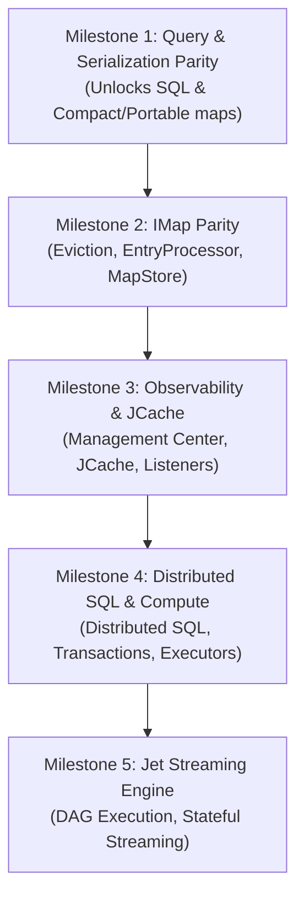

# BonsaiGrid OSS Parity Execution Roadmap

This document outlines the step-by-step sequence of tasks to bring **BonsaiGrid** to full Hazelcast OSS parity. The sequence is prioritized to maximize feature leverage, beginning with serialization and querying (which unblock advanced storage features and SQL), followed by API completeness, observability, and finally distributed compute/transactions and Jet streaming.

---

## 🗺️ Parity Milestones Sequence

---

## 📋 Detailed Breakdown per Milestone

### 🎯 Milestone 1: Query & Serialization Parity
This milestone is the highest leverage because it makes the data grid querying Hazelcast-equivalent and unblocks the core query capabilities for both Key-Value client access and SQL.

| Step | Task ID | Description | Key Target Files |
| :--- | :--- | :--- | :--- |
| **1** | **E1.T1** | **Remaining Predicate Classes:** Decode & evaluate `Between`, `Like`, `ILike`, `In`, `NotEqual`, `Not`, `Regex`, `True`, and `False` predicates. | [`crates/query/src/lib.rs`](file:///home/skodak/work/HighPerfDataGrid/bonsaigrid/crates/query/src/lib.rs) |
| **2** | **E1.T2** | **Paging & Partition Predicates:** Decode wrappers; sort/page window server-side; restrict scans to specific partition IDs. | [`crates/query/src/lib.rs`](file:///home/skodak/work/HighPerfDataGrid/bonsaigrid/crates/query/src/lib.rs) |
| **3** | **E2.T1-T2** | **Portable Serialization:** Reader/writer implementation, field extractor, and schema/class-definition replication across members. | [`crates/serialization/src/portable.rs`](file:///home/skodak/work/HighPerfDataGrid/bonsaigrid/crates/serialization/src/portable.rs) |
| **4** | **E1.T3** | **Index Store & Planner:** Build `SORTED` (B-tree), `HASH`, and `BITMAP` indices maintained during map mutation. Hook query planner to index lookups. | `crates/query/src/index.rs` (new) |
| **5** | **E1.T4** | **Aggregations & Projections:** Decode + implement count, sum, average, min, max, distinct, and projections over the scans/indices. | `crates/query/src/agg.rs` (new) |
| **6** | **E4.T1-T4** | **SQL Engine Depth (Part 1):** Typed columns, GROUP BY, ORDER BY, LIMIT, DISTINCT, and DML operations (UPDATE, DELETE, SINK INTO IMap). | [`crates/query/src/sql.rs`](file:///home/skodak/work/HighPerfDataGrid/bonsaigrid/crates/query/src/sql.rs) |

---

### 📦 Milestone 2: IMap Parity
Enriches `IMap` (the most critical API) with enterprise-grade features such as memory bounds, custom mutators, and database persistence/integration.

| Step | Task ID | Description | Key Target Files |
| :--- | :--- | :--- | :--- |
| **7** | **E3.T1-T2** | **Eviction & Expiry Policies:** LRU/LFU/RANDOM eviction when max-size limits are reached; support for `max-idle` TTL tracking. | `crates/store/src/lib.rs` |
| **8** | **E3.T3** | **EntryProcessor:** Execute server-side mutators (built-in and IDS-encoded first) on the partition owner, then replicate results. | `crates/server/src/entry_processor.rs` (new) |
| **9** | **E3.T4** | **MapStore & MapLoader SPI:** Hook up read-through, write-through, and write-behind persistence. | `crates/server/src/mapstore.rs` (new) |

---

### 👁️ Milestone 3: Observability, Listeners & JCache
Enables live monitoring through the official Hazelcast GUI (Management Center) and implements the complete events infrastructure.

| Step | Task ID | Description | Key Target Files |
| :--- | :--- | :--- | :--- |
| **10** | **E5.T1-T2** | **Advanced Listeners:** Support client subscription for lifecycle, migration, partition-lost, and predicate-filtered entry updates. | `crates/server/src/events.rs` |
| **11** | **E5.T3-T4** | **Management Center & Metrics:** Expose full JMX/Prometheus metrics. Implement the `MC*` codecs so the Management Center GUI connects. | `crates/codecs/src/mc.rs` (new) |
| **12** | **E6.T1-T3** | **ICache (JCache) & JSR-107:** Implement JCache operations, reliable topics, and HyperLogLog cardinality estimator. | `crates/server/src/cache.rs` (new) |

---

### ⚡ Milestone 4: Distributed SQL & Concurrency
Enables distributed transactions across partitions, distributed executors, and scatter-gather distributed SQL query planning.

| Step | Task ID | Description | Key Target Files |
| :--- | :--- | :--- | :--- |
| **13** | **E4.T5** | **Distributed SQL:** Scatter/gather scanning and aggregations across remote partition-owning members. | `crates/query/src/sql.rs` |
| **14** | **E7.T1-T2** | **IExecutorService:** Support server-side task execution (built-in/IDS tasks first), durable task rings, and scheduled tasks. | `crates/server/src/executor.rs` (new) |
| **15** | **E7.T3** | **Transactions (XA & 2PC):** Transaction contexts, multi-key locks, and two-phase commits across partition owners. | `crates/server/src/txn.rs` (new) |

---

### 🌪️ Milestone 5: Jet Streaming Engine
Rebuilds the Jet dataflow engine, allowing developers to run parallel, stateful streaming jobs.

| Step | Task ID | Description | Key Target Files |
| :--- | :--- | :--- | :--- |
| **16** | **E8.T1** | **DAG Submission & Executor:** Parse Jet DAG graphs and execute source -> transform -> sink pipelines locally. | `crates/jet/` (new crate) |
| **17** | **E8.T2-T3** | **Connectors & Windowing:** Tumbling, sliding, and session windows with event-time watermarks. Files/sockets/JDBC connectors. | `crates/jet/` |
| **18** | **E8.T4-T5** | **Fault Tolerance & Parallelism:** Keyed state checkpoints, distributed snapshots, partition shuffling, and job management. | `crates/jet/` |

---

> [!NOTE]
> All tasks are implemented with strict adherence to **zero-allocation hot paths**, **thread-per-core io_uring loops**, and **shared-nothing cross-core SPSC ring buffers**.
